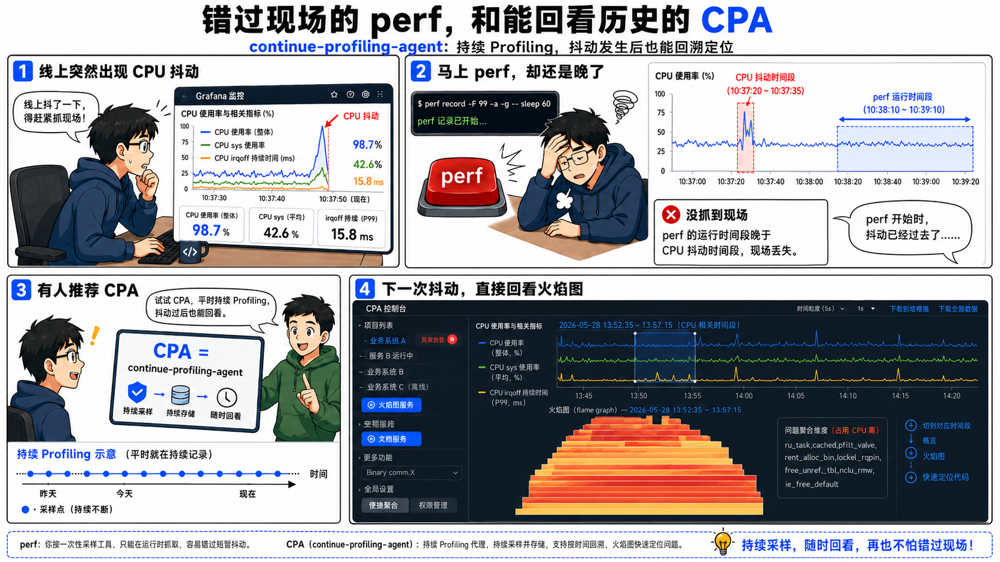
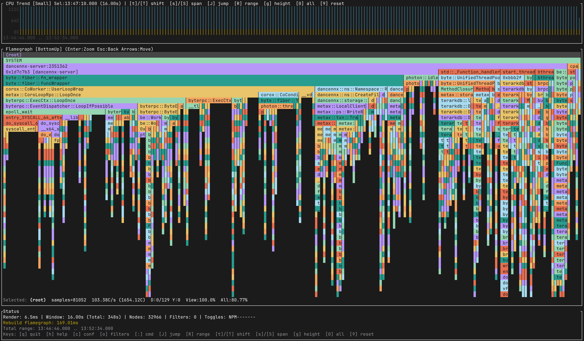
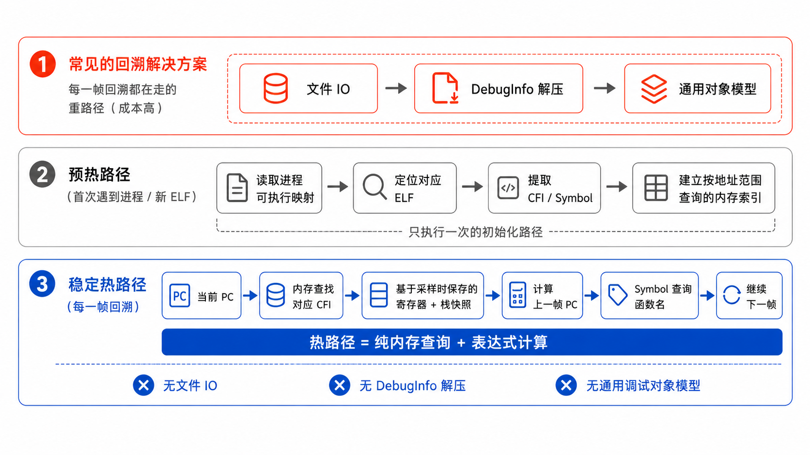
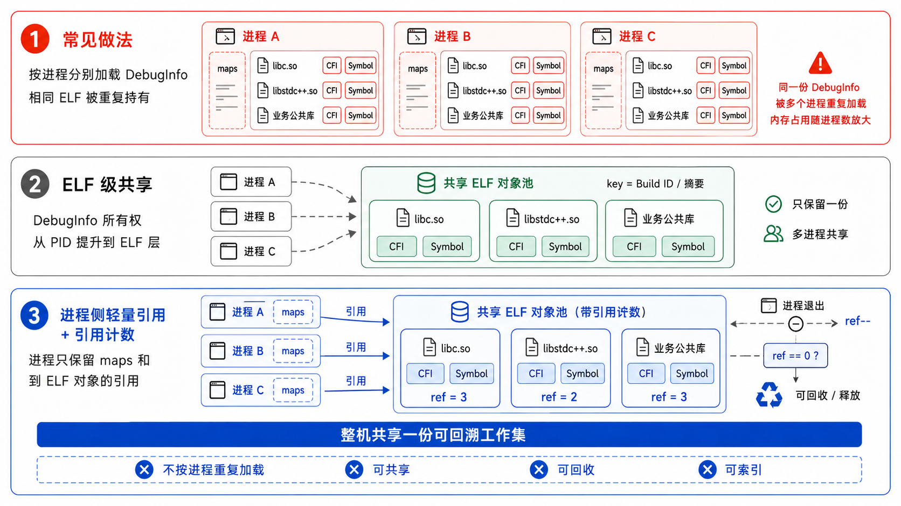
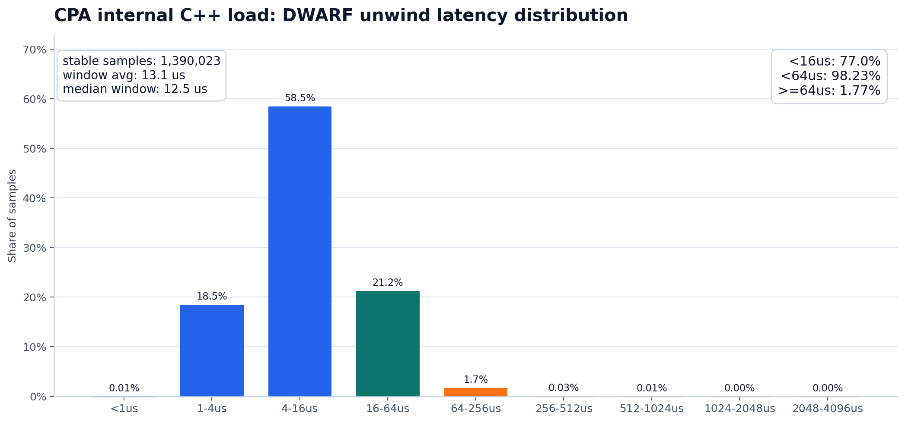
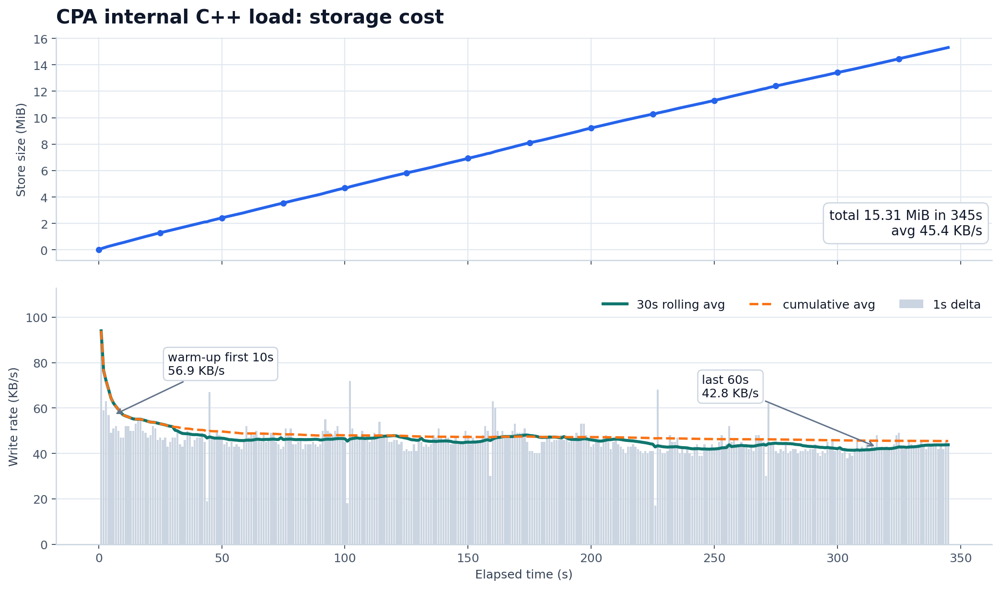

# CPA 技术解读：让性能现场持续留存

本文面向希望理解 CPA 设计取舍的读者，重点解释为什么持续 profiling
不能简单等同于“把一次性 profiler 常开”，以及 CPA 如何通过
libgunwinder、BPF/perf 采集、在线回溯和滚动存储，把性能现场长期保留下来。

## 关键词与优势

- 极低 CPU 开销：开销随采样频率、活跃 CPU、栈深度和 ELF 数量变化。
  在 19 Hz、数百核级活跃负载下，设计目标是把整机开销控制在低于
  1 个 CPU core 的量级。
- 极低内存开销：libgunwinder 只保留持续回溯需要的 CFI 和 symbol，
  并在整机范围内共享同 build-id ELF 的调试索引。
- 极低存储开销：CPA 不保存完整 `perf.data`，而是把调用栈拆成
  字符串表、栈 ID 表和秒级计数窗口，典型数据量是 KB/s 级别。
- 秒级整机火焰图：持续采样和聚合让百毫秒到秒级的抖动可以事后回看。
- IRQ-Off 支持：BPF 后端可以把长时间关中断路径纳入同一套火焰图链路。
- 生产可部署：CPA 的目标是长期常驻，而不是短时间手工抓取。

典型 16C 业务机器上，持续 profiling 的目标开销约为 0.04C CPU、
约 200 MB 内存、约 100 MB/天存储，并由 store 目录自动轮转。

## 解决目标



线上性能问题最麻烦的地方，往往不是“没有指标”，而是“指标只能告诉我们
发生过什么，不能告诉我们当时正在执行哪条路径”。一次 CPU 尖刺、一次系统
调用抬高、一次调度抖动，在监控曲线上可能只留下一个很短的凸起。等工程师
看到告警、登录机器、准备抓取现场时，问题已经过去了。

传统处理方式通常依赖两件事：尝试复现，或者提前写好触发脚本，等待下次
异常发生时再抓一段 profiling 数据。这种方式把性能诊断建立在“问题还能再来
一次”之上。

CPA 想解决的是这个断点。它把一次性的事后 profiling 变成可以长期运行的
低开销记录能力：系统持续采样、持续回溯、持续聚合。故障发生后，问题不再是
“能不能复现”，而是“回到当时那一秒看看栈”。

## CPA 提供了什么

安装 CPA 后，机器上会开始滚动保留最近几天的秒级历史火焰图。用户可以通过
`cpa show` 导出 folded/flamegraph 数据，也可以通过内嵌 TUI 直接查看历史窗口。



## 功能和资源开销

| 维度 | 说明 |
| --- | --- |
| CPU 损耗 | 取决于采样频率、活跃 CPU、用户态 DWARF 回溯比例和栈深度。 |
| 内存损耗 | 主要取决于机器上活跃 ELF 的 CFI 和 symbol 工作集大小。 |
| 存储损耗 | 持久化的是聚合后的 stack dictionary 与时间窗口计数。 |

| 典型场景 | 机器规格 | 活跃 CPU | 活跃 ELF | CPU 占用 | 内存占用 | 存储占用 |
| --- | --- | ---: | ---: | ---: | ---: | ---: |
| ClickHouse 业务机器 | 128C / 1.5T | 67C | 253 | 0.10C | 2.5G | 100M/天 |
| MySQL 独占机器 | 128C / 1.0T | 14C | 384 | 0.02C | 1.0G | 173M/天 |
| 容器场景，单机约 100 Pod | 256C / 1.0T | 143C | 2679 | 0.26C | 6.9G | 470M/天 |

这些数据的重点不是某个固定数字，而是说明 CPA 的成本主要由三个变量决定：
活跃采样量、活跃 ELF 工作集和保留周期。采样频率越高、活跃 CPU 越多，CPU
开销越高；活跃 ELF 越多，CFI 和 symbol 常驻内存越大；保留时间越长，store
占用越大。

## 为什么不能直接把 perf 常开

Perf 是 Linux 上最重要的性能分析工具之一。它的模型很清晰：

1. `perf record` 在采样时记录寄存器、栈内存和事件元数据。
2. `perf report` 在离线阶段读取 `perf.data`，加载 ELF、CFI 和符号信息，
   再恢复调用栈。

这个两阶段设计很适合通用分析工具。record 阶段尽量简单，report 阶段可以承担
复杂的符号化、源码行号、调试信息解析和后处理逻辑。

但如果要把 profiling 变成长期在线能力，这个模型会变得昂贵。假设一台
200 核机器以 19 Hz 采样，每个样本复制 64 KB 用户栈，仅原始栈快照就是：

```text
200 * 19 * 64 KB ~= 243 MB/s
243 MB/s * 86400 ~= 20 TB/day
```

这还没有计算后续 `perf report` 的 IO、debuginfo 加载、压缩段解压和 DWARF
表达式计算。Perf 适合一次高质量分析，但不是为“整机、常态、秒级历史保留”
这个目标设计的。

CPA 的问题定义不同：不保留巨大的原始现场等待离线分析，而是在采样后立即
回溯、立即聚合，只留下长期查询真正需要的结果。

## libgunwinder：为持续 DWARF 回溯压缩热路径

持续 profiling 的关键不是“能不能回溯”，而是“每秒几千次回溯能不能长期
养得起”。传统通用回溯库通常面向更宽的调试场景，需要支持源码行号、类型信息、
变量信息、调试器查询和离线分析。对 CPA 这种在线 profiling 组件来说，热路径
真正需要的东西少得多：

1. CFI，用于恢复上一帧。
2. Symbol，用于把地址转换成函数名。
3. 进程 maps，用于把 PC 映射到对应 ELF。

libgunwinder 的核心取舍是：只解析持续回溯需要的最小集合，并把它们组织成适合
在线查询的内存索引。

当第一次遇到一个进程时，libgunwinder 会读取进程的可执行映射，找到对应 ELF，
提取 CFI 和 symbol，建立按地址范围查询的结构。真正回溯时，它根据当前 PC
找到对应 CFI，基于采样时保存的寄存器和栈快照计算上一帧 PC。



这里最重要的不是某个单点优化，而是整个路径的形态变化：文件读取、debuginfo
解压和通用对象模型都被移出每帧回溯路径。稳定运行后，每一帧回溯都不应该再
回到文件 IO、debuginfo 解压和通用调试对象模型里。

只要热路径完全内存化，持续回溯就不再只是短时间打开的调试动作，而可以变成
系统的常驻能力。

## ELF 级共享：不按进程重复加载 debuginfo

如果每个进程都单独加载一份 libc、libstdc++ 或业务公共库的 CFI 和 symbol，
持续 profiling 很快会被内存拖垮。libgunwinder 把 debuginfo 的所有权从 PID
提升到了 ELF 层：

1. 每个 ELF 以 build-id 或等价摘要作为 key。
2. 多个进程映射同一个 ELF 时，CFI 和 symbol 只保留一份。
3. 每个进程只保存自己的 maps 和到 ELF 对象的引用。
4. ELF 对象通过引用计数管理生命周期。



这让系统从“每个进程各自持有一份调试信息”，变成“整机共享一份可回溯工作集”。
CPA 的内存不是简单地塞入更多 debuginfo，而是一个可共享、可回收、可索引的
在线工作集。

## IRQ-Off：把短暂的内核停顿也记录下来

很多线上抖动并不会表现成长期 CPU 热点。它可能只是某个 CPU 在很短时间内关
中断过久，用户态看起来像“机器卡了一下”。这种问题对延迟敏感系统很致命，但
传统监控往往很难捕捉：10 秒或 30 秒粒度的平均值会把它抹平，事后再去复现也
很困难。

IRQ-Off 记录补的是这块盲区。BPF 后端可以在检测到关中断时间异常时捕获现场栈，
并把它送入同一套回溯和 stackmap 聚合链路。这样最终看到的不是一个抽象的
“延迟尖刺”，而是关中断期间 CPU 停在哪条内核路径上。

普通采样回答“CPU 时间花在哪里”；IRQ-Off 回答“CPU 在哪条路径上长时间不能
响应中断”。这类现场通常非常短，正因为短，才更需要持续记录。

## 存储：不保存 perf.data，只保存可查询的历史

持续 profiling 不能只优化 CPU。存储如果按原始栈字符串记录，很快也会变成
另一个瓶颈。CPA 的存储思路是把火焰图拆成稳定的字典和时间窗口计数：

1. 函数字符串进入字符串表。
2. 一条调用栈进入栈 ID 表。
3. 每个时间窗口只记录栈 ID 和 count。

例如原始 folded stack 是：

```text
start;main;handle_request;do_syscall 7
```

持久化时可以拆成：

```text
strmap:
  start -> 1
  main -> 2
  handle_request -> 3
  do_syscall -> 4

idsmap:
  1;2;3;4 -> stack_id 42

time window:
  stack_id 42 -> count 7
```

这种格式牺牲了一部分原始事件的完整性，换来长期保存的可行性。CPA 不追求把
每一次采样都作为独立事件无限期保存，而是保留回答性能问题真正需要的信息：
某个时间窗口里，哪些调用栈占用了 CPU。

## 设计取舍

libgunwinder 和 CPA 选择了一组和传统离线 profiler 不同的取舍。

接受的成本：

1. 第一次遇到新进程或新 ELF 时需要预热。
2. 需要常驻一份最小可回溯工作集。
3. 默认不保存完整原始栈快照。
4. 默认不追求调试器级别的源码行号和语言运行时语义。

换来的能力：

1. 回溯热路径绕开文件 IO。
2. 秒级历史可以长期保留。
3. 线上问题发生后可以直接回看现场。
4. 整机维度的性能活动可以持续被记录。

CPA 不是 perf 的替代品。Perf 仍然适合单次深入分析、事件级调试和离线取证。
CPA 更像系统的行车记录仪：它不一定记录每一个调试细节，但它能持续告诉我们
事故发生时系统正在执行什么。

## 实测数据：从微基准到真实负载

性能数据可以分三层看：

1. libgunwinder 自带的 CFI 微基准，回答“CFI 查询和表达式计算本身有多快”。
2. ClickHouse workload dump，回答“复杂 C++ 负载的端到端回溯是什么量级”。
3. CPA bench，回答“采样、回溯、聚合、落盘串起来后，整体成本是否可接受”。

### CFI bench

测试机器为 Intel Xeon Platinum 8336C @ 2.30 GHz，Linux 5.15.152，
GCC 8.3.0。测试固定在 CPU0 串行执行，避免迁核和并发干扰。

| Working set | CFI frames/s | 平均 ns/frame | P50 ns | P99 ns | 16 帧采样/s | 32 帧采样/s |
| --- | ---: | ---: | ---: | ---: | ---: | ---: |
| 100 | 11,998,307 | 83.35 | 70.11 | 167.27 | 749,894 | 374,947 |
| 1,000 | 4,227,484 | 236.55 | 228.41 | 327.33 | 264,218 | 132,109 |
| 10,000 | 1,353,664 | 738.74 | 737.73 | 862.48 | 84,604 | 42,302 |

单独看 CFI 热路径，即使 working set 增长到 10,000，平均耗时仍然在
1 us 以内。真实系统里的端到端耗时不会只有这个数字，因为它还包含 maps 查询、
栈快照访问、符号处理、聚合和运行时调度。但这说明一个关键前提成立：
CFI 计算本身不是持续回溯的主要瓶颈。

### ClickHouse workload dump

下面是 ClickHouse workload dump 上的端到端 DWARF 回溯结果。它比微基准更接近
真实 C++ 负载：栈更深，ELF 更多，CFI 分布也更复杂。

| 指标 | 结果 |
| --- | --- |
| 样本数 | 360 |
| 平均帧数 | 约 36 帧以内 |
| 最大观测帧数 | 63 帧 |
| 稳态 DWARF 回溯速度 | 8.8k 到 11.3k unwinds/s |
| 稳态 DWARF 平均耗时 | 88 us 到 114 us |
| 稳态 DWARF P50 | 81 us 到 104 us |
| 稳态 DWARF P95 | 150 us 到 181 us |
| 稳态 DWARF P99 | 189 us 到 213 us |
| 稳态最大值 | 244 us 到 250 us |

这组数据更适合用来理解端到端上限：在平均几十帧、最大 63 帧的复杂 C++ dump
上，稳态 P99 仍然落在约 200 us 量级。libgunwinder 的价值不只是微基准快，
而是在复杂 C++ 符号和真实栈深度下，仍然能把回溯成本压在在线可用范围内。

### CPA bench

下面是一组生产 C++ 负载上的 CPA bench 结果。

#### CPU

稳定阶段里，DWARF unwind 平均吞吐约 4.41k samples/s，中位数约
4.39k samples/s，P95 约 4.57k samples/s。单次回溯的窗口平均耗时约
13.1 us，中位窗口约 12.5 us，P95 约 20.1 us，P99 约 22.8 us。

从聚合直方图看，稳定段内共有约 139 万次回溯：

1. 77.0% 的回溯在 16 us 内完成。
2. 98.23% 的回溯在 64 us 内完成。
3. 只有 1.77% 的回溯超过 64 us。



`pidstat` 统计里，CPA 平均约 16.8% 单核，中位数约 16.0% 单核，
P95 约 20.7% 单核。去掉周期性 flush 等尖刺后，平均约 16.2% 单核，
P95 约 20.0% 单核。在这组 C++ 常驻负载下，CPA 的常态成本大约是
0.16 个 CPU core。

#### 内存

测试尾段 RSS Total 约 644,208 KB，即约 629 MiB。更关键的是 debuginfo 核心
工作集：

1. Symbol 索引约 72,025 KB。
2. CFI FDE 约 26,729 KB。
3. CFI Data 约 18,104 KB。
4. 三者合计约 114 MiB，稳定阶段最大约 119 MiB。

这部分是 libgunwinder 为在线回溯保留的核心工作集，也是把每帧回溯从 IO 路径
挪到内存路径的前提。除此之外，栈 ID 和字符串字典相关分配约 132 MiB，
对应持续记录所需的 stack dictionary 和索引结构。

#### 存储

这段运行持续 345 秒，store dir 最终大小约 15.31 MiB，平均写入约
45.4 KB/s。



## 小结

libgunwinder 解决的是“在线回溯能不能足够便宜”的问题。它通过最小 debuginfo
加载、ELF 级共享和内存化热路径，把回溯从离线分析动作变成可持续执行的基础能力。

CPA 解决的是“这些回溯结果能不能长期留下来”的问题。它把采样、回溯、聚合和
滚动存储串成一条低开销链路，让系统在性能问题发生时自动保存足够的现场。

两者合在一起，形成的是一种面向生产环境的持续 profiling 模型：不等待复现，
不依赖临时抓取，不把所有成本推迟到事故之后，而是在系统运行时持续留下可解释的
性能轨迹。

## 附录：CPA bench 原始日志摘录

下面保留 cpa-bench 稳定运行尾部的一个统计点，用于对应正文里的吞吐、内存、
RSS、丢事件和存储数据。

```text
[05/27 13:52:32.0465] Parse Queue Len: 0 BackTrace Time: 2023751 [FP] 0 [DWARF] 1773018 [FP_BETTER] 250733 Pid Ctx: Exist: 49 Alloc: 1048 Elf Ctx: Exist: 316 Alloc: 763
[05/27 13:52:32.0465] Detailed: Symbols Mem Size: 72025.14 KB | CFI FDE Size: 26728.83 KB | CFI Data Size 18103.99 KB
[05/27 13:52:32.0465] File Queue Len: 0 Pid Exit Queue Len: 0 Store Dir: /var/log/cpa-bench/cpa_260527_start_134646 Total Size: 15677 KB
[05/27 13:52:32.0465] Lost Events: bpf perf-buffer=0 perf mmap=0
[05/27 13:52:32.0465] RSS Anon Size: 375240 KB File Size: 268968 KB Total Size: 644208 KB
[05/27 13:52:32.0465] Ids Alloc Size : 116113 KB Str Alloc Size: 9710 KB Ids Array Size: 8192 KB Str Array Size: 1024 KB
[05/27 13:52:32.0465] Bench DWARF Unwind: count=4314 rate=4313.96/s avg=12.38 us min=1.16 us max=246.28 us
[05/27 13:52:32.0465] Bench DWARF Histogram: 1-4us=730 4-16us=2582 16-64us=921 64-256us=81
[05/27 13:52:32.0465] bpf_exec_time: [2.0-4.1](us): 7477 [4.1-8.2](us): 852254 [8.2-16.4](us): 841701 [16.4-32.8](us): 75682 [32.8-65.5](us): 35 [65.5-131.1](us): 2
```
